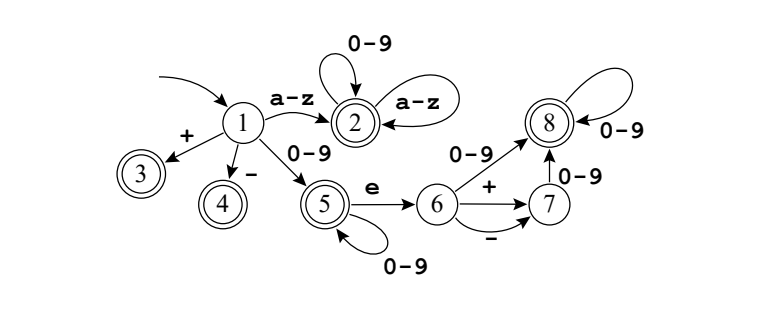

# First automaton implementarion in c++

### This program refers to the following automaton



- If the char is not recognized it will print "ERRO"
- ignore \n
<br>
<br>

## How to run code:
- Open the terminal and run the following commands
``` bash
    make
    ./Main < input.txt > output.txt 
```
- Where output.txt is the where the program output will be printed